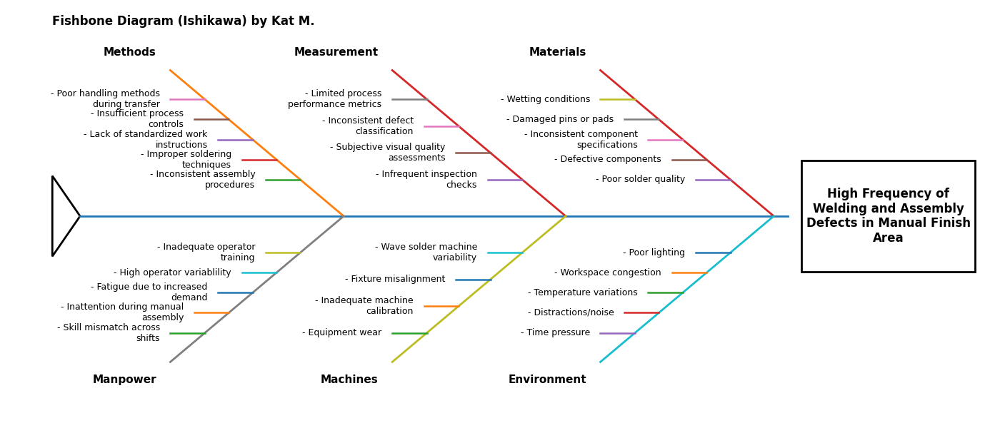
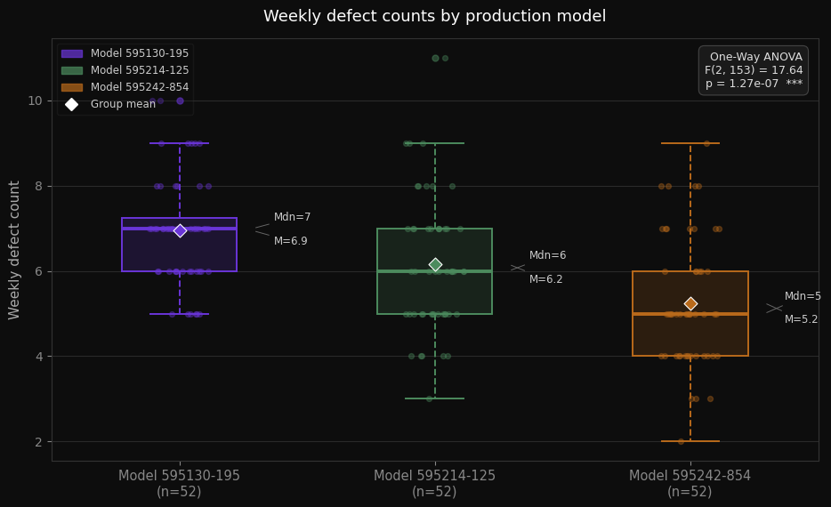
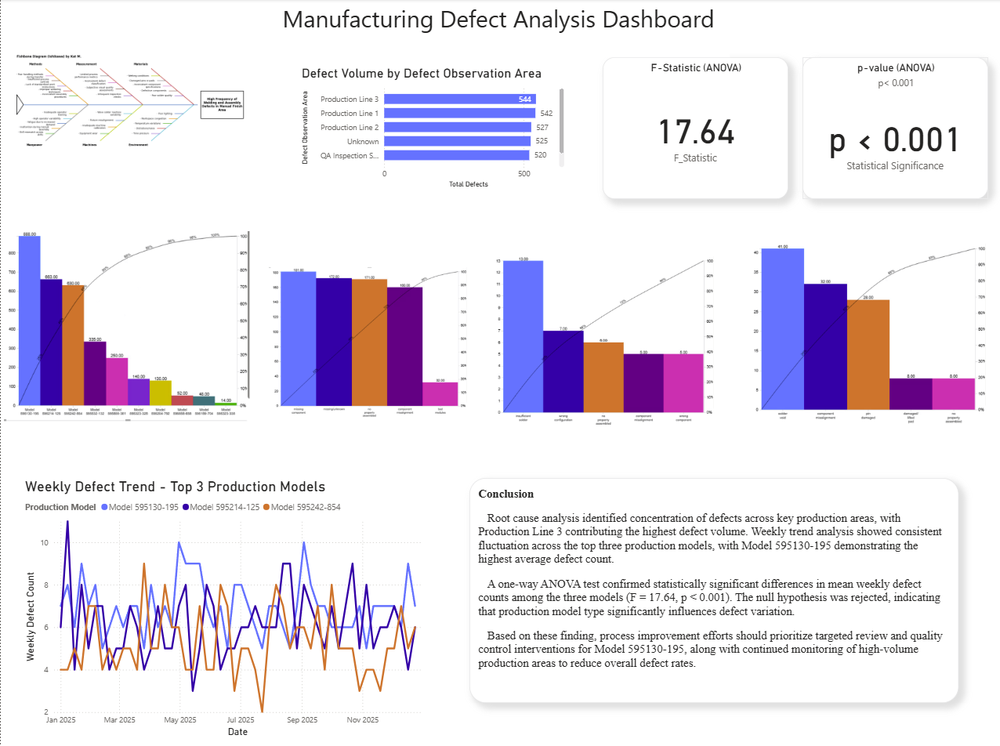

# 🔩 Manufacturing Defect Analysis  
**Capstone Project | DAT 475 | Southern New Hampshire University**

> *When defect rates climb, guessing stops. The data decides what matters.*

---

## The Problem

A manufacturing facility experienced persistent, high volumes of welding and assembly defects in the Manual Finish Area, threatening IPC-A-610E compliance and limiting production capacity amid rising demand.

The challenge wasn’t just measuring defects—it was identifying **which production models were driving them**, **how they differed**, and whether those differences reflected real process variation or statistical noise.

They weren’t noise.

---

## What I Did

This project combines root cause analysis, statistical testing, and data visualization to transform raw defect data into actionable process decisions.

**Tools used:** Python (pandas, scipy, matplotlib), Power BI, Jupyter Notebook  
**Data scope:** 3,150+ defect records across 10 production models (Jan–Nov 2025), aggregated weekly for statistical analysis (~50+ observations per model)

---

### Root Cause Analysis  
Developed a Python-generated **Ishikawa (Fishbone) Diagram** to identify contributing factors across six categories: Methods, Manpower, Measurement, Machines, Materials, and Environment.


📄 [`fishbone.py`](fishbone.py)

---

### Statistical Analysis  
Performed a **one-way ANOVA** to evaluate whether production model significantly impacts weekly defect counts across the top three models.

**Result:** F(2, 153) = 17.64, p < 0.001  
Production model is a statistically significant driver of defect variation.

The boxplot below visualizes distribution differences across models, supporting the ANOVA result and highlighting both central tendency and variability.



📓 [`anova_test_with_boxplot.ipynb`](anova_test_with_boxplot.ipynb)

---

### Dashboard  
Built an interactive **Power BI dashboard** to support ongoing monitoring and decision-making:

- Pareto analysis of defect concentration  
- Weekly defect trends by production model  
- KPI cards summarizing statistical results  
- Multi-level breakdown by defect type and observation area  


📊 [`manufacturing_defect_analysis_dashboard.pbix`](manufacturing_defect_analysis_dashboard.pbix) *(Power BI Desktop required)*  
🖼️ [`dashboard_preview.pdf`](assets/dashboard_preview.pdf) *(quick view)*

---

## What I Found

- **Defect concentration is highly skewed:** the top 3 production models account for ~68% of all defects, with Model 595130-195 alone responsible for 888 total defects  
- **Model 595130-195 is the highest-impact intervention target:** its defect profile is dominated (~95%) by missing components, improper assembly, and misalignment—clear indicators of assembly process breakdown  
- **Other models exhibit different failure modes:** Models 595214-125 and 595242-854 are driven by solder quality variation and pin damage, pointing to welding and handling issues rather than assembly  
- **Defects are evenly distributed across observation areas** (544–492 range), indicating a systemic process issue rather than a localized failure point  
- **No sustained improvement trend exists for Model 595130-195**, reinforcing the need for structured corrective action rather than passive monitoring  

---

## The Recommendation

Process improvement efforts should prioritize **Model 595130-195 as the highest-impact intervention target**, focusing on assembly controls, operator training, and component placement verification.

Secondary efforts should target Models 595214-125 and 595242-854 with improvements in wave solder calibration and component handling.

With ANOVA-confirmed variation and a weekly monitoring baseline, process changes can be evaluated with measurable statistical confidence rather than subjective observation.

---

## Repo Structure

```
manufacturing-defect-analysis/
├── README.md
├── fishbone.py
├── anova_test_with_boxplot.ipynb
├── anova_defects_per_week.csv
├── manufacturing_analysis_dashboard.pbix
└── assets/
    ├── fishbone_diagram.png
    ├── dashboard_preview.pdf
    ├── dashboard_preview.png
    └── boxplot_anova_output.png
```

---

## About Me

I'm Kat — data analyst, creative coder, chaos gremlin. I like finding the signal in messy systems and building tools that make the answer obvious.

📎 [Portfolio](https://glitchwitchkitty.github.io/chaosgremlinhq-portfolio/)  
📎 [GitHub](https://github.com/glitchwitchkitty)
